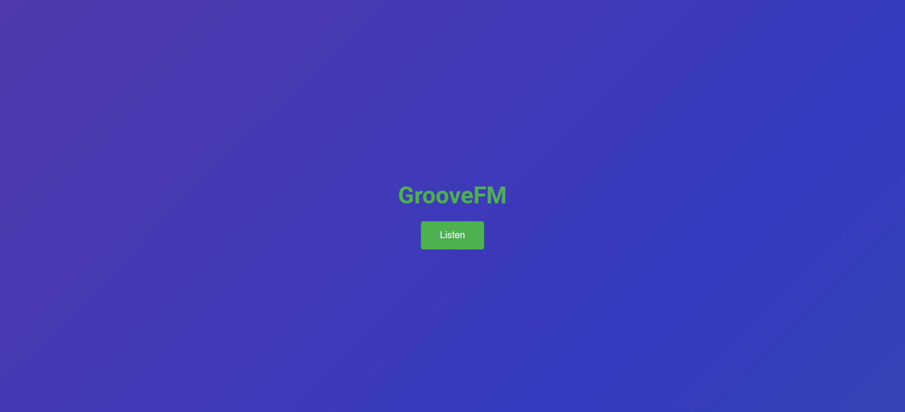

# GrooveFM 🎵

GrooveFM is a simple online radio station created with Node.js and the Express web framework. Tune in to enjoy seamless music playback, synchronized across all connected clients.



## Table of Contents

- [Features](#features)
- [Technology Stack](#technology-stack)
- [Setup](#setup)
- [Usage](#usage)
- [API Endpoints](#api-endpoints)
- [License](#license)

## Features

- 🎧 **Seamless Playback**: The audio playback is designed to be smooth and continuous.
- ⏲️ **Synchronized Timestamp**: All clients hear the same audio part at any given time.
- 🔄 **Auto-replay**: The stream automatically starts over after reaching the end.
- 💾 **Persistent State**: The server retains its state across restarts.

## Technology Stack

- [Node.js](https://nodejs.org/)
- [Express](https://expressjs.com/)
- [HTML5](https://developer.mozilla.org/en-US/docs/Web/Guide/HTML/HTML5)
- [Vanilla JS](http://vanilla-js.com/)

## Setup

Follow these steps to get GrooveFM up and running on your local machine:

1. **Clone the Repository**

    ```bash
    git clone https://github.com/DarkTwentyFive/GrooveFM.git
    ```

2. **Navigate to the Directory**

    ```bash
    cd GrooveFM
    ```

3. **Install Dependencies**

    ```bash
    npm install
    ```

4. **Initialize Timestamp File**

    If you want to initialize the timestamp, create a file named `timestamp.txt` in the root directory with the initial value (`0` for instance).

    ```bash
    echo "0" > timestamp.txt
    ```

5. **Upload Audio**: Upload your audio file to the root directory of the project and name it `music.mp3`.

6. **Set Audio Duration**: Open `index.js` and locate the following line:

    ```javascript
    const audioDuration = 0; // audio file duration
    ```

    Replace `0` with the actual duration of your audio file in seconds.


5. **Run the Server**

    ```bash
    npm start
    ```

6. Open your browser and navigate to `http://localhost:3000` to start listening!

## Usage

Click the "Listen" button to start playing the audio. The audio stream will be synchronized for all connected clients.

## API Endpoints

- `GET /`: Serve the main HTML page.
- `POST /start-counter`: Start the internal timestamp counter.
- `GET /timestamp`: Retrieve the current timestamp.
- `GET /audio`: Serve the audio file.

## License

GrooveFM is open-source and is under the MIT License. See [LICENSE](LICENSE) for more information.

---
Happy Listening with GrooveFM 🎶
